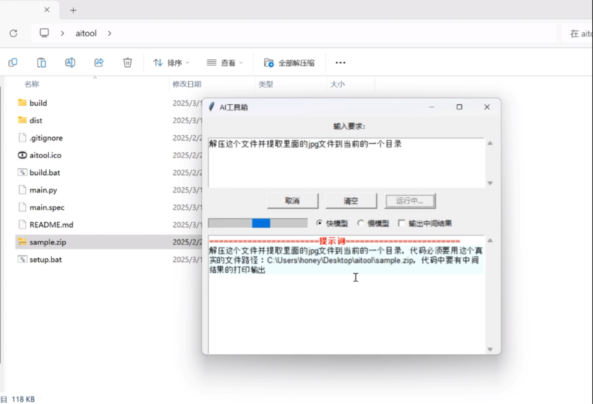

# AI工具箱

在电脑上直接通过语言描述完成操作。

当前实现的功能还很简单，可扩展的空间很大，AI越完善，打包的Python环境越充分，能做的事情越多。

# 演示

1. 解压并提取指定类型的文件

   
   

2. 合并目录里的PDF文件为一个文件

3. 批量压缩文件夹

4. 批量修改文件名

# TODO

- 多轮交互：如果第一次失败，可以主动的和AI多交流几次，直到完成任务为止。
- 上传文档给大模型完成交换任务
- 可以修改生成的代码来修复问题，修改完后可以再重新运行
- 运行结果评价与反馈
- 支持提示词建议和补全
- 支持本地大模型

