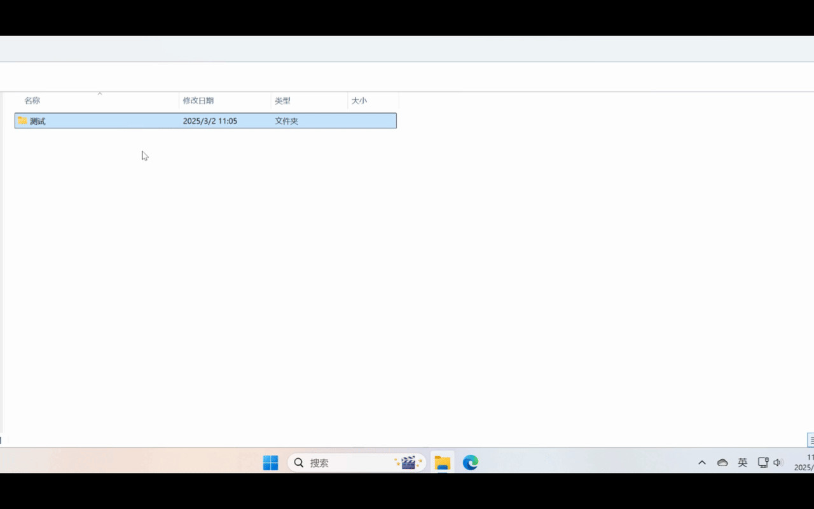

# AI工具箱

在电脑上直接通过语言描述完成操作。当前实现的功能还很简单，有时也会执行失败（提示词的质量也会影响成功率，一次不行可以多试几次😄）。可扩展的空间很大，AI越完善，打包的Python环境越充分，能做的事情越多。

# 演示

1. 解压并提取指定类型的文件【[视频](assets/unzip.mp4)】
   
   

2. 提取指定类型的文件【[视频](assets/extract.mp4)】

   

3. 合并目录里的PDF文件为一个文件【[视频](assets/pdf.mp4)】

   

4. 批量压缩文件夹【[视频](assets/zip.mp4)】

   
   
5. 批量修改文件名【[视频](assets/rename.mp4)】
   
   

# 安装与使用

- 下载最新安装包：[安装包](https://github.com/honeytidy/aitool/releases/latest)
- 解压并运行解压目录里的`setup.bat`（添加到右键菜单）
- 输入合适的提示词即可完成相关的任务，提示词越准确成功率越高

> 目前只支持Windows 11，且只在Windows 11上测试通过，其余Windows版本需要验证

# 开发

整个工具还比较原始和粗糙，界面效果和性能都没有做优化，功能也还有很多不完善的地方，如果您愿意可以随时贡献代码。

- API可以换成自己的（API Key等不方便放到代码上）
- 可以加入其他语言甚至是工具的支持，比如通过Window的脚本或者调用Windows其他工具完成复杂的任务

- **TODO LIST：**

   - [ ] 多轮交互：如果第一次失败，可以主动的和AI多交流几次，直到完成任务为止。
   - [ ] 上传文档给大模型完成交换任务
   - [ ] 可以修改生成的代码来修复问题，修改完后可以再重新运行
   - [ ] 运行结果评价与反馈
   - [ ] 支持提示词建议和补全
   - [ ] 支持本地大模型
   - [ ] 打包程序加入启动界面
